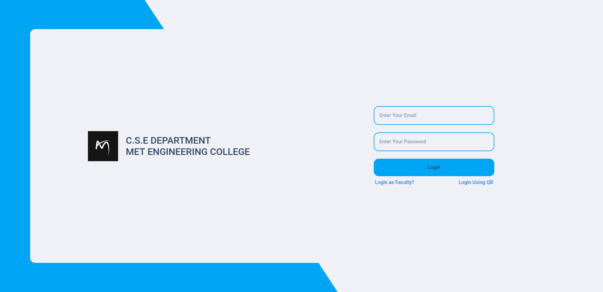
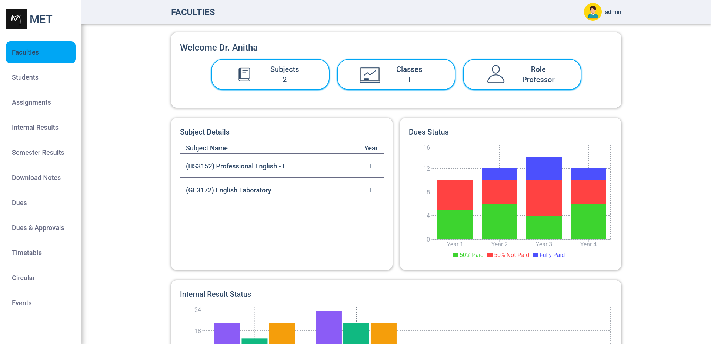
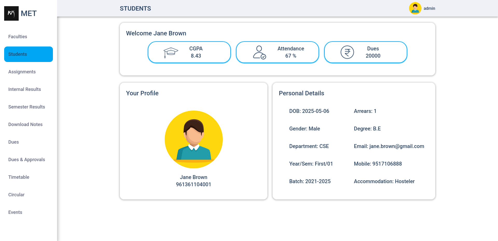
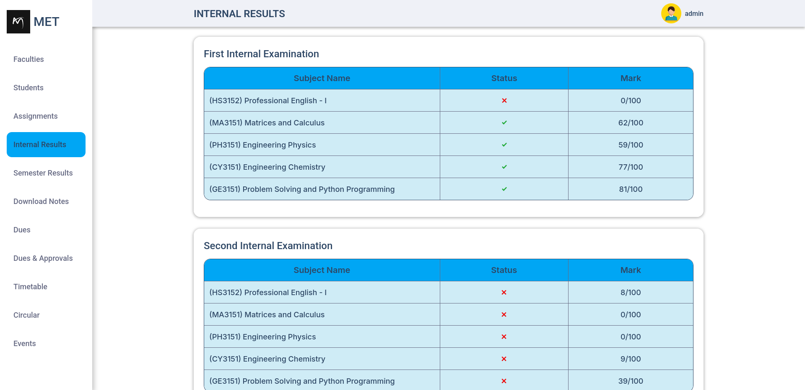
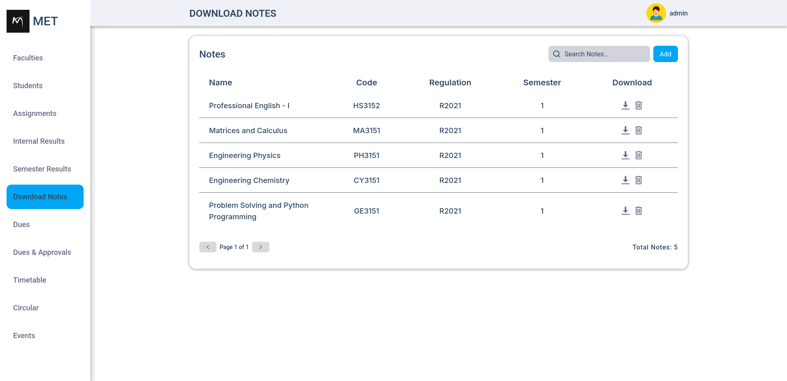
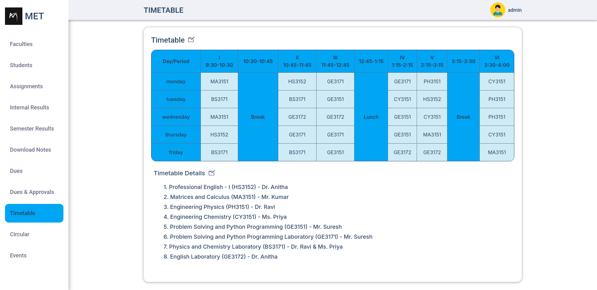

# 🎓 Student Information System

A comprehensive web-based Student Information System designed for educational institutions to streamline student and faculty academic workflows. Built using a modern monorepo architecture with **Turborepo**, it provides students, teachers, and administrators with role-based access to academic data, payment systems, and resources through a responsive and user-friendly interface.

---

## 🚀 Features

-   📊 **Student Dashboard**  
    View attendance, CGPA, dues, timetable, results, and hall ticket eligibility.

-   📥 **Resource Management**  
    Download notes and circulars shared by teachers or admin.

-   🔒 **Secure Authentication**

    -   JWT-based authentication
    -   Role-based access (student/teacher/admin)
    -   QR code login for fast and secure access

-   💸 **Dues Payment System**

    -   Razorpay integration
    -   Real-time transaction history
    -   Automatic PDF receipt generation using Playwright

-   🧾 **Dynamic Forms**  
    Forms adapt based on user roles and assigned privileges.

---

## 🧰 Tech Stack

-   **Frontend:** React, Redux, React Query, TanStack Table
-   **Backend:** Node.js, Express.js
-   **Database:** MongoDB
-   **Authentication:** JWT (JSON Web Tokens)
-   **Payments:** Razorpay
-   **PDF Generation:** Playwright
-   **UI/UX:** Figma
-   **Architecture:** Monorepo managed with Turborepo

---

## 📂 Project Structure

```
/apps
├─ web # React frontend
└─ api # Express backend

/packages
└─ types # Shared TypeScript types
```

---

## 🛠️ Getting Started

### 1. Clone the repository

```bash
git clone https://github.com/your-username/student-info-system.git
cd student-info-system
```

### 2. Install dependencies using pnpm

```bash
pnpm install
```

### 3. Setup environment variables

```
Create a .env file in the apps/api and apps/web directories with necessary credentials:
```

### 4. Run the development servers

```
pnpm turbo start:dev
```

## 📸 Screenshots














## 🔒 License

This project is proprietary. All rights reserved.  
See the [LICENSE.txt](./LICENSE.txt) file for details.

## Contact

For any questions or inquiries, please contact me at sumanadithan34@gmail.com.
